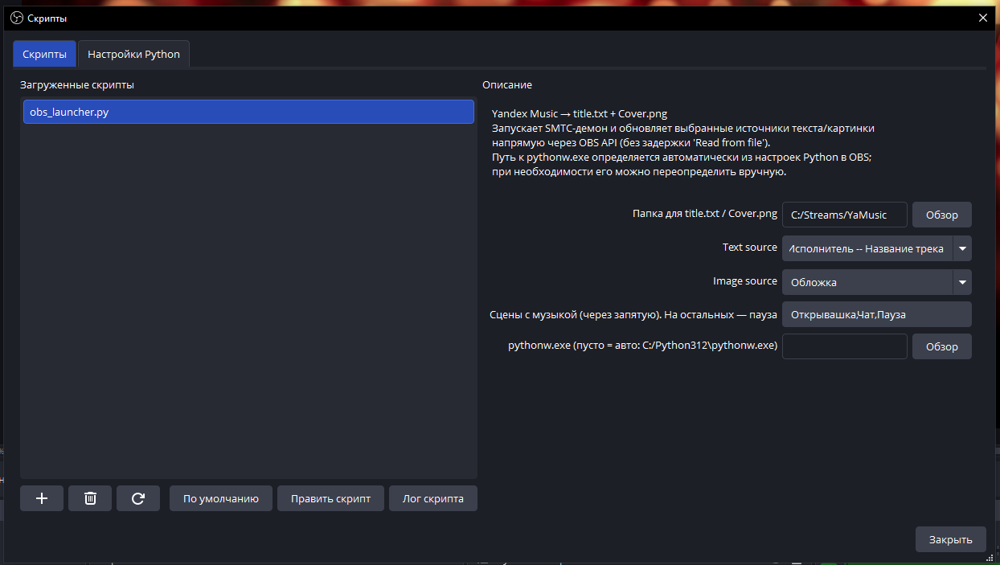

# obs-yandex-music


OBS-скрипт для отображения текущего трека из **Яндекс Музыки** на стриме: показывает «Артист – Трек» в текстовом источнике и обложку альбома в источнике-картинке. Дополнительно умеет ставить музыку на паузу при переключении на сцены, где она не нужна, и снова включать на «музыкальных» сценах.

Только Windows: данные о текущем треке берутся из системного API SMTC (System Media Transport Controls).



## Состав

- `obs_launcher.py` — скрипт, который грузится в OBS. Запускает фоновый демон, обновляет выбранные источники текста и картинки через OBS API, реагирует на смену сцен.
- `now_playing_daemon.py` — фоновый демон. Опрашивает SMTC и пишет в указанную папку:
  - `title.txt` — текущая строка `Артист – Трек`
  - `Cover.png` — обложка альбома
  - `daemon.log` — лог работы (для отладки)
- `smtc_cmd.py` — маленькая CLI-утилита для отправки `play` / `pause` / `toggle` Яндекс Музыке. Используется самим скриптом при смене сцены.

## Требования

- Windows 10/11
- OBS Studio с поддержкой Python скриптов
- Python 3.10+ (тот же, который указан в OBS → **Tools → Scripts → Python Settings → Install Path**)
- Десктопное приложение **Яндекс Музыка** (версия из Microsoft Store), которое публикует данные в SMTC
- Зависимость [`winsdk`](https://pypi.org/project/winsdk/) — поставить в тот Python, что подключён к OBS:

  ```
  pip install -r requirements.txt
  ```

## Установка

1. Склонируй репозиторий или скачай архив:
   ```
   git clone https://github.com/yunusovyf/obs-yandex-music.git
   ```
2. Установи `winsdk` в тот Python, который указан в OBS (`pip install winsdk`).
3. В OBS открой **Tools → Scripts** и убедись, что в **Python Settings** прописан путь к Python.
4. На вкладке **Scripts** добавь файл `obs_launcher.py`.
5. В свойствах скрипта заполни:
   - **Папка для title.txt / Cover.png** — куда демон будет складывать файлы (любая удобная папка).
   - **Text source** — текстовый источник OBS, в который будет идти название трека (создай заранее).
   - **Image source** — источник-картинка для обложки. В свойствах источника укажи файл `Cover.png` из той же папки.
   - **Сцены с музыкой** — список сцен через запятую (например, `Game, Just Chatting`). На остальных Яндекс Музыка автоматически встанет на паузу.
   - **pythonw.exe** — обычно определяется автоматически из настроек Python в OBS. Если в подсказке стоит «не найден» — укажи путь вручную (например, `C:\Python312\pythonw.exe`).

После заполнения папки демон сразу запустится. Включи Яндекс Музыку — название и обложка появятся в OBS.

## Как это работает

- Демон каждые 2 секунды опрашивает SMTC и ищет сессию с `source_app_user_model_id`, содержащим `Яндекс Музыка`.
- Когда трек играет — атомарно переписывает `title.txt` и `Cover.png` в выбранной папке.
- Когда трек на паузе или сессия пропала — очищает файлы (записывает пустой текст и прозрачный PNG 1×1).
- Сам OBS-скрипт раз в 100 мс проверяет `mtime` файлов и, если что-то изменилось, обновляет выбранные источники через OBS API. Для текста это `obs_source_update` напрямую (без задержки «Read from file»), для картинки — повторное применение настроек источника, чтобы он перечитал файл.
- При смене сцены OBS-скрипт смотрит, входит ли сцена в список «музыкальных», и шлёт Яндекс Музыке `play` или `pause` через SMTC.

## Отладка

Если что-то не работает — открой `daemon.log` в выбранной папке, там видно, нашлась ли сессия Яндекс Музыки, обновляются ли обложки и какие были ошибки. Логи самого OBS-скрипта смотри в **Tools → Scripts → Script Log**.

Типичные проблемы:
- **«pythonw.exe не найден»** в логе — укажи путь вручную в свойствах скрипта.
- В `daemon.log` нет записи про сессию — Яндекс Музыка не публикует данные в SMTC. Проверь, что у тебя именно десктопное приложение из Microsoft Store, а не браузер.
- Текст обновляется, а обложка нет — проверь, что в источнике-картинке указан файл `Cover.png` из той же папки, что и `title.txt`.

## Лицензия

[MIT](LICENSE)
